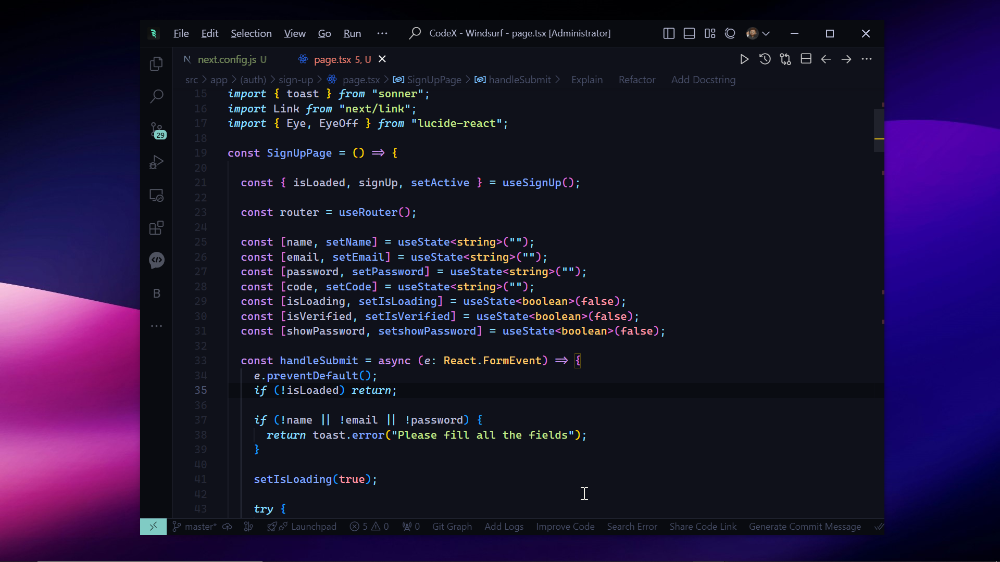

# My VSCode Configuration 🚀

> 🎯 A professionally curated VSCode setup featuring Material Theme Ocean, JetBrains Mono font, smart coding features, and AI-powered assistance. Perfect for developers who value both productivity and aesthetics.

<div align="center">



****
</div>

<div align="center">
<h3>✨ Elevate Your Coding Experience ✨</h3>
<p><em>A meticulously crafted VSCode environment combining elegant aesthetics with powerful functionality</em> 🚀</p>
</div>

## Features ✨
- **Modern Theme**: Material Theme Ocean High Contrast with transparent terminal
- **Professional Fonts**: JetBrains Mono and Cascadia Code with ligatures
- **Smart Editor Features**: Auto-formatting, bracket pair colorization, and smooth scrolling
- **Optimized Workflow**: Auto-save, quick formatting, and distraction-free coding

## Configuration Details 📦

### Editor Appearance 🎨
- Material Theme Ocean High Contrast theme
- Symbols icon theme
- Transparent terminal background
- Clean, distraction-free interface

### Editor Settings ⚙️
- Font: JetBrains Mono, Cascadia Code (Size: 13px)
- Font ligatures enabled
- Smooth scrolling
- Hidden minimap for cleaner look
- Bracket pair colorization
- Expanding cursor animation

### Smart Features 🧠
- Format on paste and type
- Prettier as default formatter
- Auto-save on focus change
- Mouse wheel zoom enabled
- Compact folder disabled for better visibility

### Language Settings 📝
- Double quotes for JavaScript/TypeScript
- Custom terminal and window styling

### AI Integration 🤖
- Bito AI with comment-to-code feature
- Streamlined Codeium integration

## Installation 🔧
1. Clone this repository:
   ```bash
   git clone https://github.com/yourusername/vscode-config.git
   ```
2. Copy `settings.json` to your VSCode settings folder:
   - Windows: `%APPDATA%\Code\User\`
   - macOS: `~/Library/Application Support/Code/User/`
   - Linux: `~/.config/Code\User/`
3. Install required extensions
4. Restart VSCode

## Required Extensions 🔌
- Material Theme
- Symbols (Icon Theme)
- Prettier (Code Formatter)
- Codeium (AI Assistant)
- Bito AI (Code Enhancement)

## Customization 🎨
The `settings.json` file is well-organized with comments for each section:
- Editor Appearance
- Editor Font Settings
- Editor Behavior
- File Management
- Language Specific
- Terminal Settings
- Window Settings
- AI Assistants Configuration

Feel free to modify any settings to match your preferences!

## Contributing 🤝
Suggestions and improvements are welcome! Feel free to open an issue or submit a pull request.
